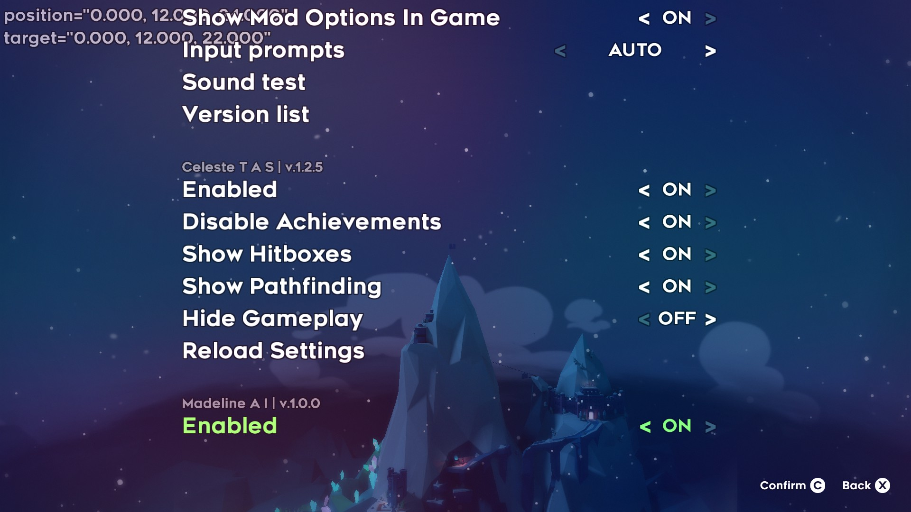

Progress has been slow this week, it feels like learning new technologies takes longer than developing them sometimes. My goals for the week have been to find Celeste mirrors to the elements present in [MarI/O](https://www.youtube.com/watch?v=qv6UVOQ0F44), and begin developing a technical prototype. These elements included save states and a fitness metric.

I wanted some kind of save state like functionality for my Celeste TASBot. I decided to investigate some existing tassing solutions to see how save states were handled. [LibTAS](http://tasvideos.org/EmulatorResources/LibTAS.html) actually does support save states for some modern titles including Celeste. However, it only runs on Linux and the save states can take several seconds to load, which is not ideal when hundreds of thousands of runs are required for machine learning training. [CelesteTAS](https://github.com/ShootMe/CelesteTAS) decided not to use save states at all when helping tassers develop their speed runs. Instead, it just plays the inputs back from the beginning of the level every time, relying on the fact that the game runs quickly and the levels are relatively short. In the end I decided I'll either have to abandon save state functionality in favor of resetting the bot at the start of each level, or implement it in a way similar to CelesteTAS.

In Mario, the goal is very simple - move right. It is easy to formulate this goal to a machine in terms of a performance metric. In Celeste, the goal is not quite as simple. One approach is to track the maximum distance the bot has traveled toward the end of the level . Level 1-A is fairly linear, so this approach might be sufficient. Level 2-A, however, has 2 different cut scene triggers in different parts of the level. This requires backtracking, for which a simple performance metric would be inefficient, if not impossible. Another approach is to predetermine the bot's route from room to room, and leave the mechanics to the machine learning. However, this approach would miss out on any interesting discoveries the bot could make by travelling a different route. After discussing with a Celeste tasser and modder, I decided the metric should be based upon the maximum distance traveled to the next checkpoint in the level. In level 1-A, there is 1 checkpoint - the end of the level. In level 2-A there are 3 checkpoints - the cut scene triggers and the end of the level. I believe this approach will help define the bot's goals better without doing too much hard coding. This metric would of course factor in speed, favoring faster times to the same location.

With these elements defined in abstract terms, it was time to begin developing MadelineAI (MAI). This would be a mod written in C# using [Everest](https://everestapi.github.io/). Having no prior experience with mod development, I naively assumed writing mods was like writing games or other applications: it would have some main function that executed everything else. Everest mods are actually C# libraries, though, they are loaded when the application starts and function by hooking into existing game methods. Typical Everest mods need a Module and a ModuleSettings. The Module loads and unloads the methods used in the mod, and the ModuleSettings contains user facing options for the mod accessible in the main menu of Celeste. I was able to compile a mod and have it loaded by Everest, although it doesn't do much besides look good so far.

The rest of my time was mostly spent examining the source code for CelesteTAS in an attempt to gleam some understanding of the Everest framework. My goals for for the coming week is to be able to supply input to the game and to fetch character and terrain information from the game via MAI. Follow up goals include building the NEAT infrastructure within MAI, or accessing the MarI/O LUA code from MAI.
