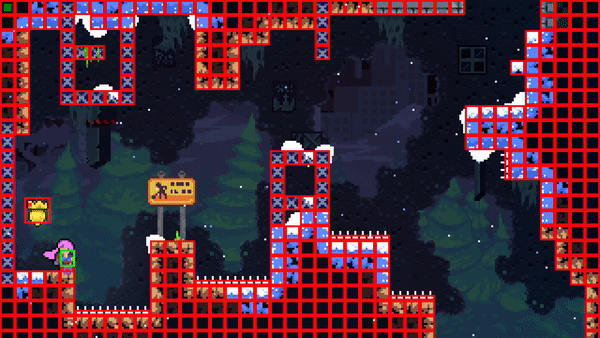
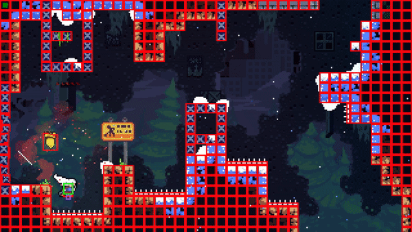

This week was for the technical fundamentals of MadelineAI. My objectives were to develop a way for my mod to simulate game pad inputs, obtain the location of the player, and obtain level tile data.

Celeste runs on the Monocle engine, a proprietary engine developed by Matt Thorson. Monocle checks the game pad state every frame and feeds that information to the game. The game then proceeds with these inputs. I was able to hook into the Monocle.MInput.Update function to insert my own code during runtime. The function essentially creates a virtual game pad using the Microsoft XNA framework, with the desired inputs pressed or released. It then sets the game pad variable held by MInput to this new game pad. These steps are sufficient to simulate button presses, but they are not sufficient for directional input. MInput has a private function UpdateVirtualInputs which is called after the original Update function. This function is required to get directional input to work. Unfortunately, it is private, and therefore inaccessible to my mod. To circumvent this, I used a program called [dnSpy](https://github.com/0xd4d/dnSpy). It allows a user to load an executable's source code, modify components, and then recompile the executable. I changed the UpdateVirtualInputs function from private to public, added the function call to the end of MAI, and now MAI supports full simulated game pad input. My solution was heavily based on [CelesteTAS](https://github.com/ShootMe/CelesteTAS) and [CelesteTAS-EverestInterop](https://github.com/EverestAPI/CelesteTAS-EverestInterop). To test my simulated game pad functionality, I wrote a couple quick scripts making use of the jump and dash mechanics.

The second part was to get information about the game state. After a lot of experimentation, I have landed on a method I believe to be as clean and efficient as possible. MAI hooks into the Monocle.EntityList.Add_Entity function. When this is called, MAI grabs a reference to the Celeste Scene. The scene contains a list of Entities, which is essentially everything on screen that we care about. From these entities, we can determine whether we are dealing with a Player, Spikes, Spring, SolidTiles, or something else. Each Entity also has a lot of information about itself, including its position and Collider. This is all that is required for a machine to understand the level.

I have been considering how best to translate this information to the machine. [MarI/O](https://www.youtube.com/watch?v=qv6UVOQ0F44) heavily simplifies the information provided to the machine, using a small grid with each square marked as a tile, enemy, or Mario. This works due to the forgiving nature of Mario's platforming, but Celeste is a much more precise game. I think a better approach for Celeste would use a much larger grid to represent information, with each square representing a pixel. Every frame, the grid would be populated with information to represent the player, tiles, spikes, springs, and any other entities the machine needs to know about. The only real way to know is to try it, and that's what I intend to do.

That's about it for this week, there's less interesting abstract stuff to talk about since time was spent developing technical solutions. Next week's objectives will be building the grid from the Entity data, developing a performance metric, and beginning construction of the NEAT algorithm.
