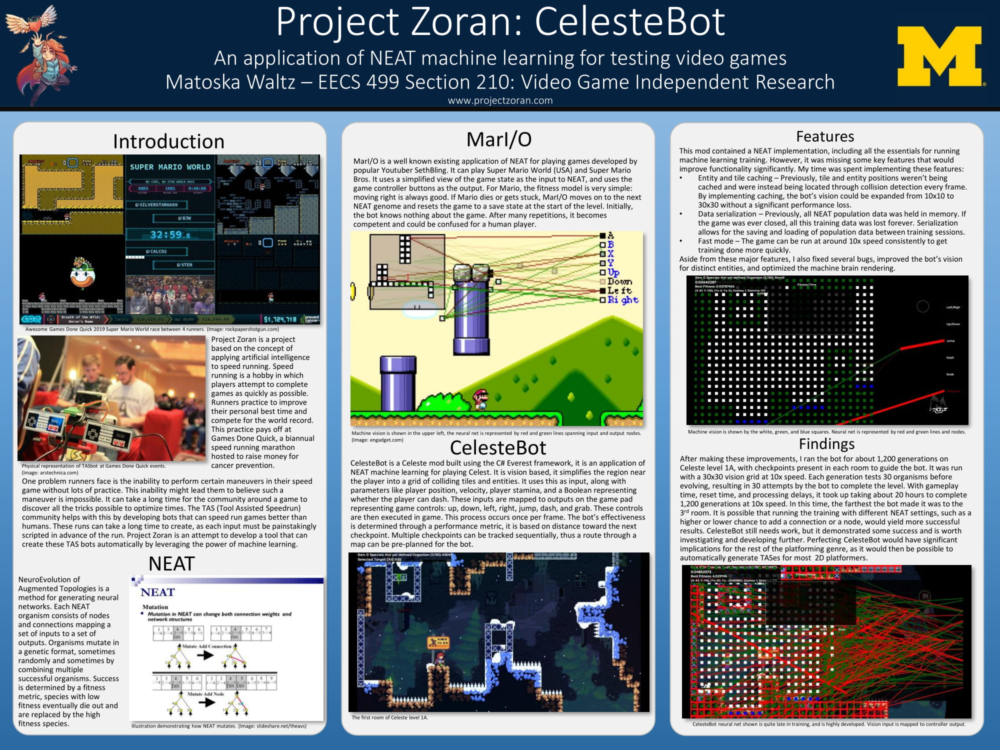

This week, I finished my research poster for the [Umich Design Expo](https://mdp.engin.umich.edu/design-expo/). I think it looks much more professional and gets to its point more concisely.

I also decided the [CelesteBot](https://github.com/sc2ad/CelesteBot/tree/qlearning) README was in need of improvement. I updated it with some "getting started" information that would be helpful for new users.

Other than that, I just ran CelesteBot on Celeste level 1A for about 3,000 generations. I haven't been able to find any settings that I think are holding it back, I believe the machine just needs to get lucky with the right mutation at this point. The only way for it to get lucky is by running the same data set for a long time, so that's what I did. It hasn't had a significant breakthrough yet, but you never know when it will figure out how to evolve.

That's pretty much it, I've just been wrapping up and making it as easy as possible for a potential successor to pick up my work.
